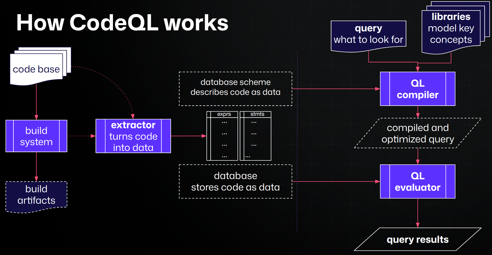

# What Is Code Scanning

> [!Important]
> **📖 Background Reading - Not Part of the Course**
>
> This page covers assumed knowledge and is provided as a reference for self-study. It is up to the instructor's discretion whether this is covered during session. If you are already familiar with code scanning concepts, feel free to skip ahead to the next section.

Modern applications ship fast, but every line of code you write can introduce vulnerabilities. Manual code review catches some of these, but it does not scale. Code scanning is GitHub's integrated static analysis capability that automatically examines your source code for security vulnerabilities and coding errors, surfacing findings as actionable alerts directly in pull requests and on the repository's Security tab.

Code scanning is the third pillar of GitHub Advanced Security, complementing secret scanning (which detects leaked credentials) and *ependabot (which identifies vulnerable dependencies). While those features focus on secrets and third-party code, code scanning targets vulnerabilities in your own first-party code - the code your team writes every day.

## How Code Scanning Works

### The Analysis Engine: CodeQL

At the heart of GitHub's code scanning capability is CodeQL, a semantic code analysis engine developed by GitHub. CodeQL treats code as data:

1. Build extraction - CodeQL creates a database representation of your codebase
2. Query execution - Security queries written in the CodeQL query language are executed against the database. Each query looks for a specific vulnerability pattern — for example, a dataflow path from an untrusted user input to a SQL query without proper sanitization.
3. Result generation - Matches are reported as alerts, each tied to the specific file, line, and dataflow path that triggered the finding. A SARIF file is generated and uploaded onto GitHub.

CodeQL supports a wide range of languages and frameworks. For the full list, see [Supported languages and frameworks](https://codeql.github.com/docs/codeql-overview/supported-languages-and-frameworks/).

### Query Suites

CodeQL ships with curated sets of queries called query suites

| Suite | Purpose | Typical Use |
|---|---|---|
| **`default`** | High-precision security queries with very low false-positive rates | Recommended for most repositories; ideal for pull request gating |
| **`security-extended`** | Broader set of security queries, including lower-severity and slightly higher false-positive findings | Useful when you want deeper coverage and can tolerate more triage |
| **`security-and-quality`** | Security queries plus code quality and maintainability checks | For teams that want code scanning to cover style and correctness, not just security |

The `default` suite is optimized for developer experience — it prioritizes findings that are almost certainly real vulnerabilities, minimizing alert fatigue. The `security-extended` suite casts a wider net at the cost of some additional noise.

### Third-Party Tool Support via SARIF

Code scanning is not limited to CodeQL. Any static analysis tool that produces results in SARIF (Static Analysis Results Interchange Format) can upload findings to GitHub's code scanning infrastructure.

Third-party results appear in the same Security tab and pull request annotations as CodeQL findings, providing a unified view of all static analysis results.

## Default Setup vs. Advanced Setup

GitHub offers two ways to configure code scanning:

### Default Setup

Default setup is the fastest way to enable code scanning. With a single click in repository settings, GitHub automatically:

- Detects the languages in your repository.
- Selects the appropriate CodeQL query suite (`default` or `security-extended`).
- Configures an Actions workflow that runs on every push to the default branch and on every pull request targeting the default branch.
- Manages the workflow file internally - no YAML file appears in your repository.

Default setup is ideal for most repositories, especially those using interpreted languages. It requires zero configuration and keeps itself up to date as GitHub improves CodeQL.

### Advanced Setup

Advanced setup gives you full control by adding a CodeQL workflow YAML file (`.github/workflows/codeql.yml`) to your repository. With advanced setup you can:

- Customize the query suite or add individual queries.
- Configure build steps for compiled languages.
- Target specific branches or paths.
- Adjust scheduling (e.g., run on a nightly cron in addition to push/PR triggers).
- Add third-party SARIF upload steps alongside CodeQL.
- Use custom CodeQL configuration files and query packs.

Advanced setup is recommended when you need to customize the build process, use custom queries, or combine CodeQL with other tools.

## Code Scanning Alerts

### Where Alerts Appear

- Pull request checks -  When code scanning runs on a PR, new findings are shown as annotations directly in the PR diff. The PR check can be configured to require a passing scan before merge.
- Security tab - All alerts (from all branches) are listed in the repository's Security → Code scanning alerts view.
- Organization-level overview - Security managers can view code scanning alerts across all repositories from the organization's Security tab.

### Alert Lifecycle

| State | Meaning |
|---|---|
| **Open** | A vulnerability has been detected and has not yet been remediated or dismissed. |
| **Closed (fixed)** | The vulnerable code has been removed or corrected, and the alert no longer appears in subsequent scans. |
| **Dismissed (false positive)** | The finding is not a real vulnerability. |
| **Dismissed (won't fix)** | The finding is acknowledged but will not be addressed. |
| **Dismissed (used in tests)** | The code is in a test context and does not pose a production risk. |

### Alert Severity

CodeQL assigns severity levels to alerts based on the Common Weakness Enumeration (CWE) and the nature of the vulnerability:

| Severity | Meaning |
|---|---|
| **Critical** | Exploitable vulnerability with high impact (e.g., remote code execution) |
| **High** | Serious vulnerability likely exploitable in common configurations |
| **Medium** | Vulnerability that requires specific conditions to exploit |
| **Low** | Minor issue or informational finding |

## Copilot Autofix

When CodeQL detects a vulnerability, Copilot Autofix can automatically generate a suggested fix. Autofix uses GitHub Copilot's AI capabilities to:

1. Analyze the CodeQL alert and its dataflow path.
2. Generate a code change that addresses the vulnerability.
3. Present the fix as a suggestion the developer can review and apply directly from the alert or pull request.

Autofix dramatically reduces the time from detection to remediation. Instead of requiring the developer to understand the vulnerability class, trace the dataflow, and craft a fix manually, Autofix provides a ready-made solution that the developer can review and commit with a single click.

> **Note:** Autofix suggestions should always be reviewed by a developer before applying. While the AI-generated fixes are generally accurate, they may not account for all application-specific context.

## Enabling Code Scanning

Code Scanning can be enabled in default mode at the repository, organization or enterprise level. 
Advanced set up can only be enabled at the repository level. 
CodeQL action cannot be enforced via Rulesets to make them required workflows. 
CodeQL action can be used as reusable workflows.

## Operational Considerations

### Performance and Build Times

CodeQL analysis adds time to your CI pipeline. For large codebases, analysis can take 10–30 minutes or more. Consider:

- Running code scanning on a schedule (nightly) in addition to PR triggers to reduce PR feedback latency.
- Using path filters in advanced setup to limit analysis to changed directories.
- Caching CodeQL databases in Actions to speed up subsequent runs.

### Alert Triage at Scale

At enterprise scale, initial enablement can surface hundreds or thousands of pre-existing alerts. Plan your rollout:

- Start with a pilot group of repositories.
- Use the `default` query suite initially to minimize noise.
- Leverage alert severity and Copilot Autofix to prioritize remediation.
- Use dismiss reasons to track accepted risk.

### Branch Protection Integration

Configure branch protection rules to require code scanning checks to pass before merge. This creates a security gate that prevents new vulnerabilities from reaching the default branch.

## Further Reading

- [About code scanning](https://docs.github.com/en/enterprise-cloud@latest/code-security/code-scanning/introduction-to-code-scanning/about-code-scanning)
- [About CodeQL](https://docs.github.com/en/enterprise-cloud@latest/code-security/code-scanning/introduction-to-code-scanning/about-code-scanning-with-codeql)
- [Configuring default setup](https://docs.github.com/en/enterprise-cloud@latest/code-security/code-scanning/enabling-code-scanning/configuring-default-setup-for-code-scanning)
- [Configuring advanced setup](https://docs.github.com/en/enterprise-cloud@latest/code-security/code-scanning/creating-an-advanced-setup-for-code-scanning/configuring-advanced-setup-for-code-scanning)
- [SARIF support for code scanning](https://docs.github.com/en/enterprise-cloud@latest/code-security/code-scanning/integrating-with-code-scanning/sarif-support-for-code-scanning)
- [About Copilot Autofix for code scanning](https://docs.github.com/en/enterprise-cloud@latest/code-security/code-scanning/managing-code-scanning-alerts/about-autofix-for-codeql-code-scanning)
