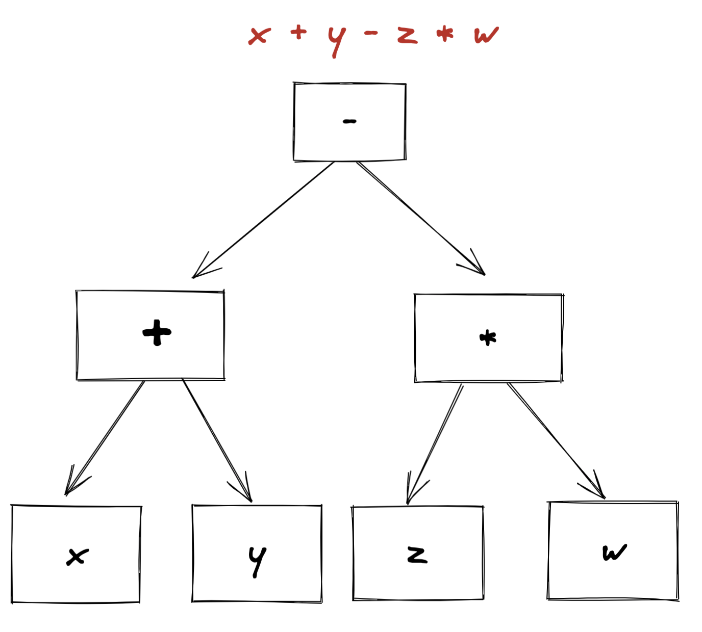
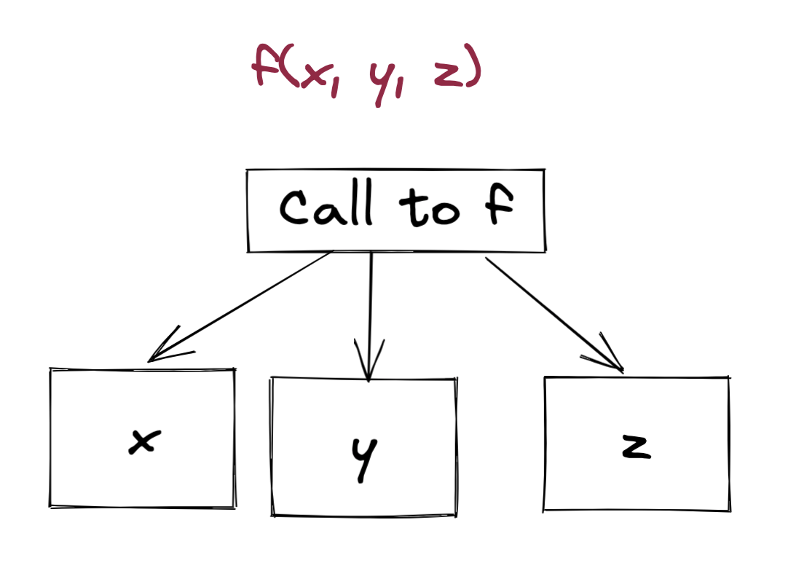
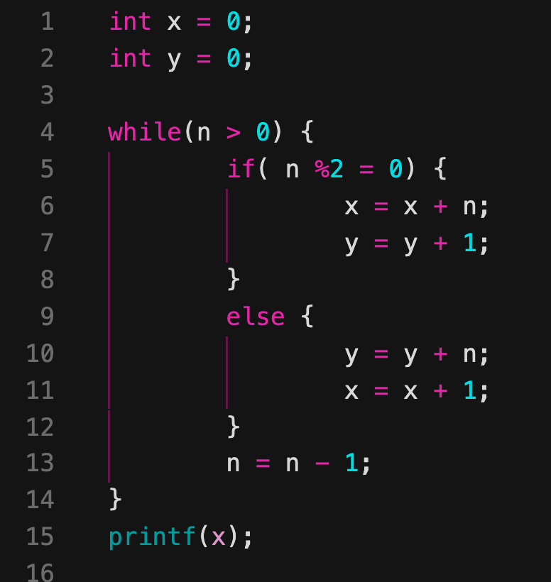
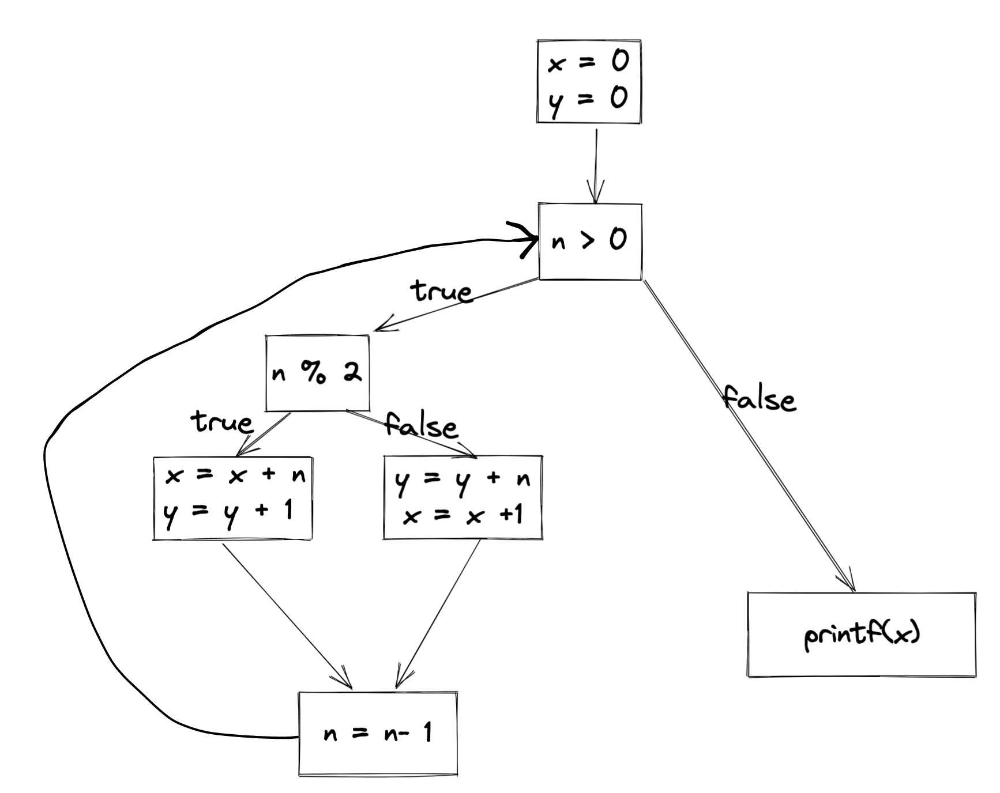
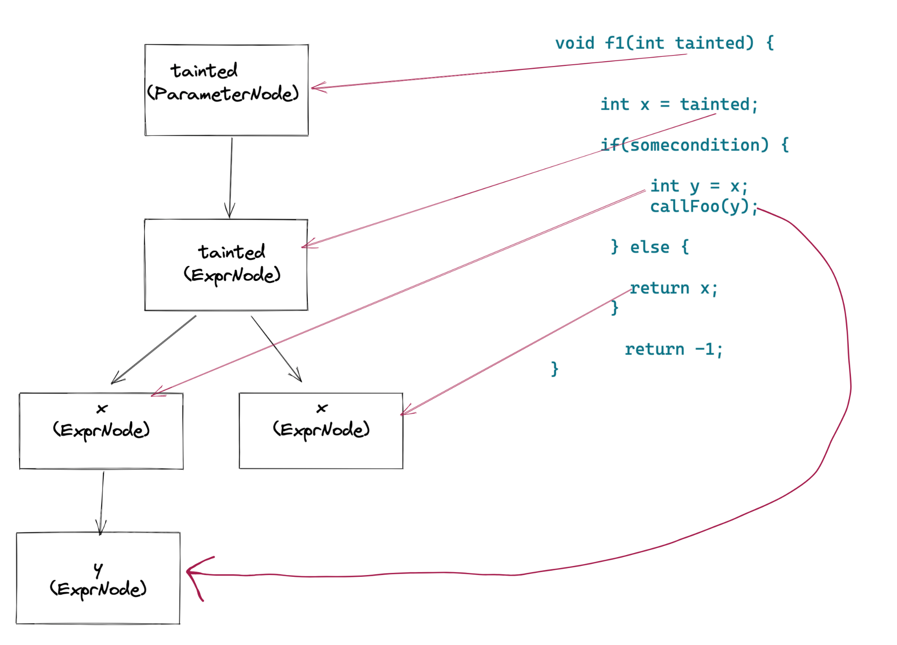
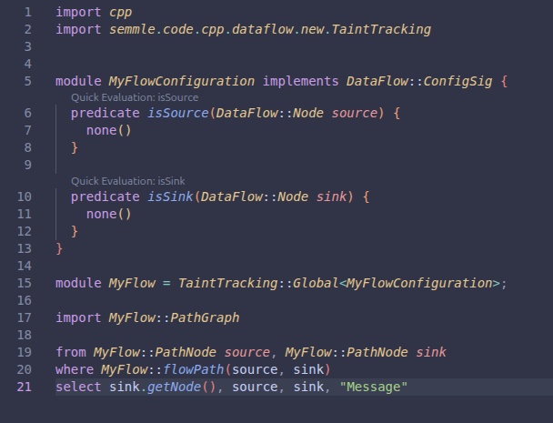

# CodeQL Foundations

CodeQL's power comes from its ability to track data through your code - from untrusted sources, through transformations, into security-sensitive sinks. Out of the box, CodeQL ships with queries for thousands of widely used libraries and frameworks. But an organization may depends on internal libraries, proprietary frameworks, and less common third-party packages that CodeQL has no built-in knowledge of. This is where customization plays a key role.

To fully understand the different customization methods and why it matters, you first need to understand the foundational representations CodeQL builds from your source code: the Abstract Syntax Tree, Control Flow Graph, and Data Flow Graph.

## CodeQL Characteristics

### Language Concepts

CodeQL is a declarative, object-oriented query language designed specifically for analyzing source code. It draws from Datalog and relational logic - you describe *what* you want to find, and CodeQL's engine determines *how* to find it efficiently across the entire codebase.

#### Query Structure

Every CodeQL query follows a **from–where–select** pattern, analogous to SQL:

```ql
from MethodAccess call
where call.getMethod().hasName("executeQuery")
select call, "Potential SQL query execution"
```

| Clause | Purpose |
|---|---|
| **from** | Declares variables and their types - the entities you want to reason about |
| **where** | Specifies logical conditions that constrain the results |
| **select** | Defines what to output - the matched elements and an alert message |

#### Predicates

Predicates are the fundamental building blocks of CodeQL logic. A predicate defines a relation - a set of tuples that satisfy a logical condition. Predicates can be thought of as reusable functions that return sets of results.

```ql
predicate isPublicMethod(Method m) {
  m.isPublic() and
  not m.isStatic()
}
```

Predicates without a result type (like above) act as Boolean filters. Predicates *with* a result type return values:

```ql
string getLogLevel(LogCall log) {
  result = log.getArgument(0).toString()
}
```

#### Classes

CodeQL uses classes to define sets of values that share a logical property. Unlike traditional OOP classes, a CodeQL class describes a subset of an existing type by applying a characteristic predicate - a logical condition every member must satisfy.

```ql
class SecuritySensitiveMethod extends MethodAccess {
  SecuritySensitiveMethod() {
    this.getMethod().hasName("executeQuery") or
    this.getMethod().hasName("exec") or
    this.getMethod().hasName("eval")
  }
}
```

Classes support inheritance and can override member predicates, which is how CodeQL's standard libraries organize language-specific AST types into queryable hierarchies.

#### Types and Type Hierarchy

Every expression in CodeQL has a type. The type system is organized as a hierarchy rooted in the language-specific AST classes. Each supported language has its own set of AST classes documented in the CodeQL standard libraries:

- [Java AST classes](https://codeql.github.com/docs/codeql-language-guides/abstract-syntax-tree-classes-for-working-with-java-programs/)
- [Python AST classes](https://codeql.github.com/docs/codeql-language-guides/abstract-syntax-tree-classes-for-working-with-python-programs/)
- [JavaScript/TypeScript AST classes](https://codeql.github.com/docs/codeql-language-guides/abstract-syntax-tree-classes-for-working-with-javascript-and-typescript-programs/)
- [C# AST classes](https://codeql.github.com/docs/codeql-language-guides/abstract-syntax-tree-classes-for-working-with-csharp-programs/)
- [Ruby AST classes](https://codeql.github.com/docs/codeql-language-guides/abstract-syntax-tree-classes-for-working-with-ruby-programs/)
- [Go AST classes](https://codeql.github.com/docs/codeql-language-guides/abstract-syntax-tree-classes-for-working-with-go-programs/)

You navigate the hierarchy using predicates like `getParent()`, `getAnAncestor()`, and `getAChild*()`. The prefix `getA` (as in `getAMethod()`) indicates that the predicate may return multiple values - a core concept in CodeQL's set-based logic.

#### Logical Connectives and Quantifiers

CodeQL provides standard logical operators along with quantifiers for reasoning over sets:

| Construct | Meaning |
|---|---|
| `and`, `or`, `not` | Standard Boolean logic |
| `exists(Type v \| condition)` | True if at least one value satisfies the condition |
| `forall(Type v \| guard \| condition)` | True if every value satisfying the guard also satisfies the condition |
| `forex(Type v \| guard \| condition)` | Like `forall`, but also requires at least one value matches the guard |

#### Aggregates

Aggregates compute summary values over sets, similar to SQL aggregate functions:

| Aggregate | Purpose | Example |
|---|---|---|
| `count(...)` | Count matching values | `count(Method m \| m.isPublic())` |
| `sum(...)` | Sum numeric values | `sum(Method m \| ... \| m.getNumberOfParameters())` |
| `max(...)` / `min(...)` | Maximum / minimum value | `max(int n \| ... \| n)` |
| `avg(...)` | Average value | `avg(Method m \| ... \| m.getNumberOfLines())` |
| `concat(...)` | Concatenate string values | `concat(string s \| ... \| s, ", ")` |

#### Modules

Modules group related predicates, classes, and other modules into namespaces. Query packs and library packs are organized as module hierarchies, and you import them with `import` statements:

```ql
import java
import semmle.code.java.dataflow.TaintTracking
```

> **Key takeaway:** CodeQL combines the expressive power of object-oriented modeling with the precision of relational logic. You write queries that describe vulnerability patterns declaratively, and the engine evaluates them against the entire code database.

### Abstract Syntax Tree (AST)

The Abstract Syntax Tree (AST) of a program represents the program's syntactic structure. Every program element from class declarations to individual operators is represented as a node in the tree. AST abstracts away parsing details like parentheses and semicolons, focusing instead on the logical structure of the code.



CodeQL stores the AST as a relational model in the database using a schema called the dbscheme. You can explore the AST of any source file using the AST Viewer in VS Code, which is built into the CodeQL extension.



> **Why it matters:** The AST is the foundational data structure from which CodeQL derives all other analyses. Queries that look for syntactic patterns such as finding all calls to a specific method, or detecting unused variables operate directly on the AST.

### Control Flow Graph (CFG)

The Control Flow Graph (CFG* is derived from the AST and models the flow of execution through a program. While the AST captures *what* the code says, the CFG captures the order in which statements can execute.



Key concepts in control flow analysis:

| Concept | Description |
|---|---|
| **Predecessor / Successor** | A node X is a predecessor of Y if execution can flow directly from X to Y |
| **Domination** | A node X **dominates** Y if every execution path to Y must pass through X |
| **Post-domination** | A node Y **post-dominates** X if every execution path from X to the exit must pass through Y |



> **Why it matters:** Control flow information is essential for determining whether a piece of code is reachable, whether a variable has been initialized before use, and whether a sanitization step is guaranteed to execute before a dangerous operation.

### Data Flow Graph

The Data Flow Graph models how data moves through a program. Nodes represent expressions or parameters that carry values, and edges represent the flow of data between them.



CodeQL provides two levels of data flow analysis:

| Type | Scope | Performance |
|---|---|---|
| **Local (intra-procedural)** | Flow within a single function or method | Fast - analyzed in isolation |
| **Global (inter-procedural)** | Flow across function calls, through return values, and across object fields | More expensive - requires whole-program analysis |

Local data flow is sufficient for detecting patterns like using an unchecked value within the same method. Global data flow is required for tracking taint across the boundaries of functions, classes, and modules.

### Taint Tracking

Security queries in CodeQL rely on taint tracking - a specialized form of data flow analysis that traces data from untrusted inputs (called sources) to security-sensitive operations (called sinks).



| Term | Definition | Example |
|---|---|---|
| **Source** | An entry point where untrusted data enters the program | `HttpServletRequest.getParameter()` |
| **Sink** | A security-sensitive operation that should not receive untrusted data | `Statement.executeQuery(String)` |
| **Sanitizer** | A function that transforms data in a way that makes it safe | `ESAPI.encoder().encodeForSQL()` |

A taint-tracking query reports a finding when there is a data flow path from a source to a sink without passing through a sanitizer. This is the mechanism behind the majority of CodeQL's security queries.

## Further Reading

- [About CodeQL](https://codeql.github.com/docs/codeql-overview/about-codeql/)
- [CodeQL language reference](https://codeql.github.com/docs/ql-language-reference/)
- [About data flow analysis](https://codeql.github.com/docs/writing-codeql-queries/about-data-flow-analysis/)
- [Analyzing data flow in Java](https://codeql.github.com/docs/codeql-language-guides/analyzing-data-flow-in-java/)
- [Using the AST viewer in VS Code](https://docs.github.com/en/enterprise-cloud@latest/code-security/codeql-for-vs-code/using-the-advanced-functionality-of-the-codeql-for-vs-code-extension/exploring-the-structure-of-your-source-code)
- [CodeQL query help](https://codeql.github.com/codeql-query-help/)

