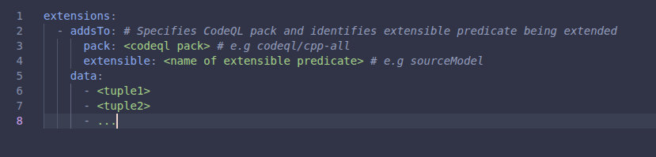
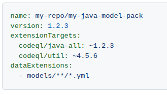

# CodeQL Models as Data

As covered in the previous chapter, CodeQL's dataflow analysis relies on knowing how data moves through every method call in your code - which methods introduce tainted data, which ones pass it along, and which ones consume it in dangerous ways. The built-in query packs already model the standard libraries and popular frameworks, but they cannot anticipate every dependency your organization uses. Models as Data (MaD) bridges that gap by letting you describe library behavior in structured YAML - no QL authoring required - so CodeQL's existing queries automatically gain visibility into your custom and internal code.

## The Problem: Gaps in Framework Coverage

Consider a typical enterprise Java application that uses an internal HTTP framework. The framework has a method `RequestContext.getParam(String name)` that reads user-supplied input from an HTTP request. CodeQL's taint-tracking analysis needs to know that the return value of this method is untrusted - it's a *source* of taint. Without that knowledge, CodeQL cannot trace data from this method into a downstream SQL query, and the SQL injection vulnerability goes undetected.

Traditionally, closing this gap required writing custom CodeQL queries or library models in QL - a powerful but specialized skill. Models as Data provides a declarative alternative: you describe the behavior of your library's methods in structured data (YAML), and CodeQL incorporates that information into its existing queries automatically.

## How Models as Data Works

### Core Concepts

Models as Data operates on three fundamental concepts that map directly to CodeQL's dataflow analysis:

| Concept | What It Describes | Example |
|---|---|---|
| **Source** | A method whose return value or output parameter introduces untrusted data into the program | `HttpServletRequest.getParameter()` returns user input |
| **Sink** | A method whose parameter receives data that, if tainted, constitutes a vulnerability | `Statement.executeQuery(String)` executes a SQL string |
| **Summary** | A method that propagates taint from one parameter (or `this`) to the return value or another parameter | `StringBuilder.append(String)` propagates taint from the argument to the return value |

By declaring sources, sinks, and summaries for your libraries, you extend CodeQL's taint-tracking graph to cover code paths that flow through those libraries - without modifying any query logic.

> [!Note]
> **Demo:** How CodeQL makes predicates extensible for existing queries.

### Model Packs

Models are packaged as CodeQL model packs - directories containing YAML extension files that follow a specific schema. A model pack is structured as:

```
my-custom-models/
├── qlpack.yml
└── models/
    └── my-framework.model.yml
```

The `qlpack.yml` identifies the pack:

```yaml
name: my-org/my-custom-models
version: 1.0.0
library: true
extensionTargets:
  codeql/java-all: "*"
```

The `extensionTargets` field specifies which CodeQL language pack this model extends. The `"*"` means it applies to all versions of the target pack.

### Extension File Format

Model definitions live in `.model.yml` files. Each file contains one or more `extensions` entries that declare data extensions for specific CodeQL extensible predicates. For example:

```yaml
extensions:
  - addsTo:
      pack: codeql/java-all
      extensible: sourceModel
    data:
      - ["my.framework", "RequestContext", False, "getParam", "(String)", "", "ReturnValue", "remote", "manual"]

  - addsTo:
      pack: codeql/java-all
      extensible: sinkModel
    data:
      - ["my.framework", "DatabaseClient", False, "execute", "(String)", "", "Argument[0]", "sql-injection", "manual"]

  - addsTo:
      pack: codeql/java-all
      extensible: summaryModel
    data:
      - ["my.framework", "StringUtils", False, "sanitize", "(String)", "", "Argument[0]", "ReturnValue", "taint", "manual"]
```

### Column Schema

The exact columns in each data row differ by language. Refer to the language-specific documentation for the full schema:

- [Java / Kotlin](https://codeql.github.com/docs/codeql-language-guides/customizing-library-models-for-java-and-kotlin/)
- [C# (.NET)](https://codeql.github.com/docs/codeql-language-guides/customizing-library-models-for-csharp/)
- [Python](https://codeql.github.com/docs/codeql-language-guides/customizing-library-models-for-python/)
- [JavaScript / TypeScript](https://codeql.github.com/docs/codeql-language-guides/customizing-library-models-for-javascript/)
- [Ruby](https://codeql.github.com/docs/codeql-language-guides/customizing-library-models-for-ruby/)
- [Go](https://codeql.github.com/docs/codeql-language-guides/customizing-library-models-for-go/)
- [Swift](https://codeql.github.com/docs/codeql-language-guides/customizing-library-models-for-swift/)
- [C / C++](https://codeql.github.com/docs/codeql-language-guides/customizing-library-models-for-cpp/)
- [GitHub Actions](https://codeql.github.com/docs/codeql-language-guides/customizing-library-models-for-actions/)

## The CodeQL Model Editor

The CodeQL Model Editor in VS Code provides a visual interface for creating and managing models without writing YAML by hand.



### Supported Languages

The Model Editor currently supports:

- C#
- Java / Kotlin
- Python
- Ruby

### Capabilities

The Model Editor can:

- Analyze a CodeQL database to discover unmodeled methods.
- Generate YAML model files from your selections.
- Model sources, sinks, and summaries through a point-and-click interface.

### Modes

| Mode | Description |
|---|---|
| **Application Mode** | Analyzes your application code and identifies calls to external frameworks that are not yet modeled. Use this when you want to model the third-party libraries your application depends on. |
| **Dependency Mode** | Analyzes the public API surface of a library and lets you model all of its public methods. Use this when you are the author of a library and want to publish a model pack for your consumers. |

> [!Note]
> **Demo:** CodeQL Model Editor


## Using Models as Data in Practice

### With Default Setup

When using default setup you can reference it in your repository's code scanning configuration. GitHub will automatically download and apply the pack during analysis.

### With Advanced Setup

In an advanced setup workflow, reference the model pack in your CodeQL configuration file (`.github/codeql/codeql-config.yml`):

```yaml
packs:
  java:
    - my-org/my-custom-models@1.0.0
```

Or reference it directly in the workflow YAML:

```yaml
- name: Initialize CodeQL
  uses: github/codeql-action/init@v3
  with:
    languages: java
    packs: my-org/my-custom-models@1.0.0
```

### Repository-Level Model Packs

You can also place model packs directly in your repository without publishing them:



Place model packs in:

```
.github/codeql/extensions/
```

They will automatically be used by CodeQL scanning without needing to publish to a registry.

> [!Note]
> **Demo:** [Publishing demo](https://github.com/ghas-samples/quick-api-publish-demo)
### At Organization Scale

For consistent coverage across the organization:

1. Maintain a central repository containing model packs for all internal frameworks.
2. Publish packs to the organization's GHCR namespace.
3. Reference the packs in organization-level CodeQL configurations.
4. Use security configurations to ensure all repositories include the model packs.

## AI-Generated Models

You an use Copilot to automatically generate models for your project's dependencies. Like all AI generated content it is imperative that a human verifies what is modelled is correct. 

## When to Use Models as Data

| Scenario | Approach |
|---|---|
| Internal framework not modeled by CodeQL | Write manual models for sources, sinks, and summaries |
| Niche third-party library with no CodeQL support | Write manual models or enable AI-generated models |
| Large codebase with many unmodeled dependencies | Enable AI-generated models for broad coverage, supplement with manual models for critical frameworks |
| CodeQL reports false negatives for known vulnerability patterns | Check whether the library methods involved are modeled; add missing models |
| CodeQL reports false positives through a sanitizer | Add a summary model showing taint passes through a sanitizing function |

## Further Reading

- [About CodeQL model packs](https://docs.github.com/en/enterprise-cloud@latest/code-security/code-scanning/managing-your-code-scanning-configuration/editing-your-configuration-of-default-setup#codeql-model-packs)
- [Using the CodeQL model editor](https://docs.github.com/en/enterprise-cloud@latest/code-security/code-scanning/managing-your-code-scanning-configuration/editing-your-configuration-of-default-setup)
- [CodeQL model packs documentation](https://codeql.github.com/docs/codeql-cli/creating-and-working-with-codeql-packs/)
- [Customizing library models for CodeQL](https://codeql.github.com/docs/codeql-overview/customizing-library-models-for-codeql/)
