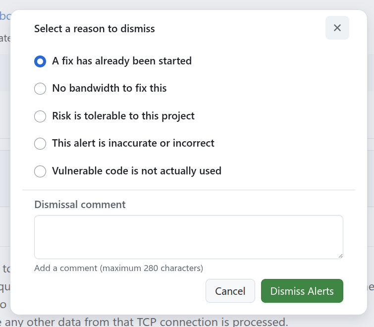

# Dependabot Alerts

> [!Important]
> **📖 Background Reading - Not Part of the Course**
>
> This page covers assumed knowledge and is provided as a reference for self-study. It is up to the instructor's discretion whether this is covered during session. If you are already familiar with supply chain security concepts, feel free to skip ahead to the next section.

The previous chapters established the foundation: the dependency graph tracks every package your project depends on, the Dependency Submission API fills in the gaps that static analysis misses, and SBOMs provide a machine-readable inventory for audit and compliance. With this visibility in place, the natural next question is: which of these dependencies have known vulnerabilities?

Dependabot alerts answer that question. They continuously match the dependencies in your dependency graph against the [GitHub Advisory Database](https://github.com/advisories) and notify you when a vulnerable version is detected. Alerts are not a one-time scan - they are a living, event-driven system that reacts to both changes in your dependencies and newly published advisories.

## How Dependabot Alerts Work

### The Matching Engine

When a new advisory is published to the GitHub Advisory Database or when your dependency graph changes (e.g., a new manifest is committed or a dependency submission is received) - Dependabot performs a comparison:

1. It enumerates every dependency in your repository's dependency graph, including both statically analyzed and API-submitted dependencies.
2. For each dependency, it checks whether the package name and version fall within the affected range of any known advisory.
3. If a match is found, Dependabot creates an alert on the repository.

This matching is bidirectional: a new advisory triggers re-evaluation of all existing dependency graphs, and a dependency graph change triggers re-evaluation against all existing advisories. This means you will be alerted even if the vulnerability was disclosed months after you adopted the dependency.

### The GitHub Advisory Database

The GitHub Advisory Database is the vulnerability intelligence source behind Dependabot alerts. It aggregates data from [multiple upstream sources](https://docs.github.com/en/code-security/concepts/vulnerability-reporting-and-management/about-the-github-advisory-database#about-the-github-advisory-database). 

GitHub curates and reviews advisories, adding ecosystem-specific metadata (affected version ranges, package identifiers, patched versions) that the raw CVE data often lacks. This curation is what enables precise matching - Dependabot knows not just that "a vulnerability exists in library X" but that it affects "versions ≥ 1.2.0 and < 1.2.5 in the npm ecosystem."

> **Key detail:** Dependabot alerts only fire for advisories that have been reviewed by GitHub and mapped to a specific package ecosystem. Unreviewed advisories in the NVD that lack ecosystem metadata will not trigger alerts until they are curated.

### Alert Severity

Each alert inherits the severity of the underlying advisory, scored using CVSS (Common Vulnerability Scoring System):

| Severity | CVSS Score Range |
|---|---|
| Critical | 9.0 – 10.0 |
| High | 7.0 – 8.9 |
| Medium | 4.0 – 6.9 |
| Low | 0.1 – 3.9 |

Dependabot also surfaces the [EPSS score](https://www.first.org/epss/user-guide) (Exploit Prediction Scoring System) where available, which estimates the probability that a vulnerability will be exploited in the wild within the next 30 days. Combining CVSS severity with EPSS probability gives a more actionable triage signal than severity alone.

## Alert Anatomy

Each Dependabot alert provides:

- Advisory details - CVE identifier, GHSA identifier, description, severity, and CVSS vector.
- Affected dependency- The package name, current version, and the manifest or submission source where it was detected.
- Patched version - The minimum version that resolves the vulnerability, if one exists.
- Dependency scope - Whether the dependency is a runtime or development dependency, helping you assess exposure.

## Enabling Dependabot Alerts

Dependabot alerts can be enabled at the repository, organization, or enterprise level.  Each scope carries different trade-offs around control, rollout speed, and policy enforcement. These are covered in the sections that follow.

## Triaging Alerts

### Alert States

Dependabot alerts exist in one of the following states:

| State | Meaning |
|---|---|
| **Open** | The vulnerability is present and unresolved. |
| **Dismissed** | A human has reviewed the alert and determined it does not require action. A dismissal reason is required. |
| **Fixed** | The vulnerable dependency has been updated to a non-vulnerable version (detected automatically by Dependabot). |
| **Auto-dismissed** | The alert was automatically dismissed based on auto-dismiss rules (covered below). |

### Dismissal Reasons

When dismissing an alert, you must select a reason:

Dismissal reasons are visible in audit logs, the security overview, and API responses, creating accountability for triage decisions.

> **Governance tip:** Define what each dismissal reason means in your organization and when it may be used. Communicate these definitions to developers before rolling out Dependabot alerts — inconsistent dismissal practices produce unreliable data in the security overview and audit logs.

### Prioritization Strategies

With potentially hundreds of alerts across an organization, effective prioritization is essential. Consider layering these signals:

1. Severity + EPSS - Start with critical/high severity alerts that also have a high EPSS score. These represent known-exploitable, high-impact vulnerabilities.
2. Dependency scope - Runtime dependencies are typically higher priority than development-only dependencies, as they are present in deployed artifacts.
3. Patch availability - Alerts with a known patched version are easier to remediate. Prioritize these for quick wins.
4. Repository criticality - Not all repositories carry equal risk. A vulnerability in a customer-facing production service is more urgent than one in an internal documentation site.

## Auto-Dismiss Rules

For large organizations, manual triage of every alert is not scalable. Dependabot auto-dismiss rules let you define criteria under which alerts are automatically dismissed, reducing noise without losing the audit trail.

### How Auto-Dismiss Works

Auto-dismiss rules are configured at the repository or organization level. When a new alert matches a rule's criteria, it is automatically moved to the `Auto-dismissed` state. The alert remains visible (it is not deleted) and can be reopened if the rule is later removed or the criteria change.

### Built-In Rules

GitHub provides built-in auto-dismiss rules that leverage GitHub's own vulnerability intelligence:

- Dismiss low-impact development alerts - Automatically dismisses alerts for vulnerabilities in development-only dependencies that are unlikely to be exploitable (based on ecosystem, scope, and vulnerability characteristics).

> **Important:** Custom auto-triage rules that open pull requests and Dependabot security updates are mutually exclusive. If you want a custom rule to open PRs for matching alerts, Dependabot security updates must be disabled on that repository. When security updates are enabled, Dependabot automatically attempts to open PRs for *all* open alerts with available patches, overriding any rule-based targeting. See [Understanding how custom auto-triage rules and Dependabot security updates interact](https://docs.github.com/en/enterprise-cloud@latest/code-security/dependabot/dependabot-auto-triage-rules/customizing-auto-triage-rules-to-prioritize-dependabot-alerts#understanding-how-custom-auto-triage-rules-and-dependabot-security-updates-interact).

### Custom Rules

You can create custom auto-dismiss rules based on:

- Severity - Dismiss alerts below a certain severity threshold.
- Ecosystem - Target specific package ecosystems.
- Scope - Target development-only or runtime dependencies.
- Package name - Dismiss alerts for specific packages you have assessed and accepted.
- CWE - Target specific weakness categories.
- CVSS score - Set a numeric threshold.

Custom rules are particularly useful for:

- Suppressing alerts on vendored internal packages that you maintain and have already assessed.
- Automatically dismissing low-severity alerts in non-production ecosystems (e.g., test tooling).
- Reducing noise from advisories in CWE categories that do not apply to your deployment environment (e.g., browser-specific XSS in a server-only context).

> **Caution:** Auto-dismiss rules are powerful but require careful tuning. Overly broad rules can suppress legitimate vulnerabilities. Start with narrow, well-understood criteria and expand gradually. All auto-dismissed alerts remain visible for audit purposes.

## Dependabot Alerts and the Security Overview

At scale, individual repository alerts are insufficient for organizational governance. The Security Overview dashboard available at the organization and enterprise level aggregates Dependabot alert data across all repositories.

Security managers can use the overview to identify repositories that are falling behind on remediation, enforce triage SLAs, and measure the effectiveness of supply chain security investments.

## Delegated Alert Dismissal

By default, any user with write access to a repository can dismiss a Dependabot alert. In regulated or high-governance environments, this may not provide sufficient control. A developer could dismiss a critical alert without security team oversight.

Delegated alert dismissal addresses this by preventing direct dismissals. When enabled, developers who attempt to dismiss an alert instead create a *dismissal request* that must be reviewed and approved by an organization owner or security manager. The alert remains open until the request is approved.

This feature can be enabled at the repository, organization, or enterprise level.

> **Operational note:** Delegated dismissal introduces an approval bottleneck. Ensure your security manager team has adequate capacity to review dismissal requests regularly - unreviewed requests block developers and erode trust in the process. You can create a [custom organization role](https://docs.github.com/en/enterprise-cloud@latest/organizations/managing-peoples-access-to-your-organization-with-roles/about-custom-organization-roles) with permission to review dismissal requests, allowing you to delegate triage to a broader group without granting full security manager access. Dismissal requests can be reviewed from the [security overview](https://docs.github.com/en/enterprise-cloud@latest/code-security/security-overview/review-alert-dismissal-requests).

## Notifications and Integrations

### Notification Channels

Dependabot alert notifications can be delivered through:

- GitHub notifications - In-app notifications for repository watchers and users with security alert access.
- Email - Configurable per-user in notification settings.
- Webhooks - The `dependabot_alert` webhook event fires on alert creation, dismissal, reopening, and auto-dismissal. Use this to integrate with external ticketing systems (Jira, ServiceNow), Slack/Teams channels, or custom dashboards.

### API Access

The [Dependabot alerts REST API](https://docs.github.com/en/enterprise-cloud@latest/rest/dependabot/alerts) provides programmatic access to alerts at the repository, organization, and enterprise level. Common use cases include:

- Building custom dashboards that combine Dependabot data with internal risk scores.
- Automating triage workflows (e.g., auto-assigning alerts to the team that owns the affected dependency).
- Exporting alert data for compliance reporting.

## Operational Considerations

### Alert Volume Management

Large organizations with thousands of repositories can generate significant alert volume. Strategies for managing this include:

- Enable auto-dismiss rules for low-risk categories before rolling out Dependabot alerts organization-wide.
- Use security configurations to roll out alerts incrementally - start with critical repositories and expand.
- Establish triage SLAs (e.g., critical alerts triaged within 24 hours, high within 1 week) and track compliance through the security overview.

## Further Reading

- [About Dependabot alerts](https://docs.github.com/en/enterprise-cloud@latest/code-security/dependabot/dependabot-alerts/about-dependabot-alerts)
- [Configuring Dependabot alerts](https://docs.github.com/en/enterprise-cloud@latest/code-security/dependabot/dependabot-alerts/configuring-dependabot-alerts)
- [Viewing and updating Dependabot alerts](https://docs.github.com/en/enterprise-cloud@latest/code-security/dependabot/dependabot-alerts/viewing-and-updating-dependabot-alerts)
- [Using auto-triage rules to manage Dependabot alerts](https://docs.github.com/en/enterprise-cloud@latest/code-security/dependabot/dependabot-auto-triage-rules)
- [About the GitHub Advisory Database](https://docs.github.com/en/enterprise-cloud@latest/code-security/security-advisories/working-with-global-security-advisories-from-the-github-advisory-database/about-the-github-advisory-database)
- [REST API endpoints for Dependabot alerts](https://docs.github.com/en/enterprise-cloud@latest/rest/dependabot/alerts)
- [Configuring dependency review](https://docs.github.com/en/enterprise-cloud@latest/code-security/supply-chain-security/understanding-your-software-supply-chain/configuring-dependency-review)
